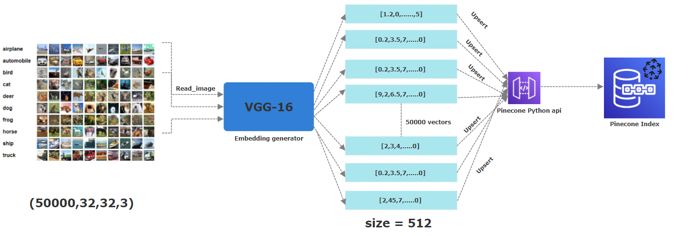

# IMAGE SEARCH APP


## Project Intro
The advent of the internet revolutionized the way we access information through potent search engines such as Google, Bing, and Yandex. With just a few keywords, we can swiftly locate web pages pertinent to our queries. As technology, particularly AI, advances, many search engines now facilitate online image searches.

Various techniques for image searching have emerged, including:

* image search by metadata:
Here, the search is  not based on the image itself but rather on the metadata following the image like (keywords, text, filename,date etc.) <br> 
* image search based on image content:
This approach uses, state of the art computer vision techniques to extract shape, colour, any relevant features from an image. This is the technique we are going to study.


In this project, we will use a pre-trained Convolutional Neural Network (CNN) to extract valuable features from the images. This methodology, a key component of content-based image search, provides the following benefits:<br> 

* CNN are robust:
CNN have proven to be very powerful to extract key features from an image.
* CNN can reduce dimension:
The CNN output typically represents a condensed, relevant representation of the image often called **feature map or embedding or vectors**, as not every pixel holds significant information. This condensed representation often has smaller dimensions.


In summary, in this study we will like to answer the following question:
**Are two similar images associated embedding are still similar?**

### Technologies / Frameworks used 
* 
* 
* 

## Project Description
For this project, we've used the Cifar-10. It's  is a freely available dataset comprising **60,000** color images, each measuring **32x32 pixels**. These images belong to **10** distinct categories: Airplane, Automobile, Bird, Cat, Deer, Dog, Frog, Horse, Ship, and Truck. To obtain their corresponding embeddings, we applied a pre-trained CNN model, specifically **[VGG-16](https://medium.com/@mygreatlearning/everything-you-need-to-know-about-vgg16-7315defb5918)**, to extract essential features. The resulting vector is **512-dimensional**. Within Pinecone, we created an index named "images" with a dimension of 512, where all these vectors will be stored.


THe idea behind this project is to find if similar images of Birds for example have similar embeddings. To do so,we've uploaded 50,000 out of the total 60,000 images associated embedding to a pinecone index . This partition was made to ensure that we have entirely new and distinct images compared to those already stored as vectors in Pinecone. Also note that this paritioning is already done by the cifar-10 dataset into train and test batches representing the serialized versions of the original images.

## Working principle
The picutre below describe the whole process of storing the embeddings to a pinecone index. From the first step of reading the images, applying a pre-trained VGG16 neural network to generate 512 dimensional embbedings which are then upserted (ie stored) in a pinecone index. 


## Running time
In this project, we are handling videos, which pose some challenges in terms of compution especially when reading videos, capturing frames and extracting features via a CNN.
We tried to leverage the power of parrallel computing when running our code so that everything runs as fast as possible on multiple  CPU cores via multithreading.<br> 
*Note: If possible, run this project on a GPU powered environment for faster computations.*


## Getting Started
1. Create a pinecone account for free [here](https://www.pinecone.io/)
2. Get the api key and environement associated to your pinecone account 
3. Clone this repo (for help see this [tutorial](https://help.github.com/articles/cloning-a-repository/)).
    
4. Create a virtual environment in the project folder (for help see this [tutorial](https://www.freecodecamp.org/news/how-to-setup-virtual-environments-in-python/))

5. Run the following command to install the necessary packages
* For linux users:
```
pip3 install -r requirements.txt
```
* For windows users:
```
pip install -r requirements.txt
```
6. Launch the image insertion script using the following
```
python insert_data.py -key <APY_KEY>  -env <ENV>  -metric <METRIC> 
```
*Replace \<ENV> and <APY_KEY> with the values you get from your pinecone account.*
*Wait for the script to be done.*
7. Launch the app using the following 
```
streamlit run app.py -- -key <APY_KEY> -env <ENV>
```


